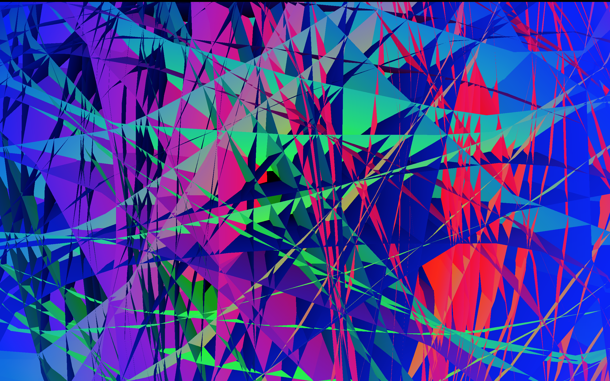
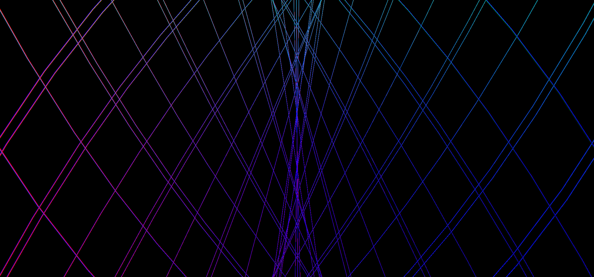
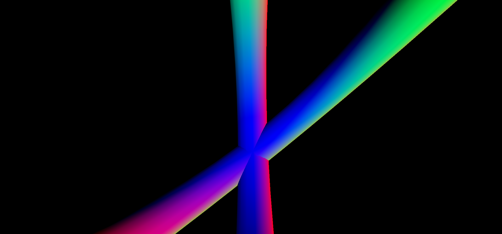
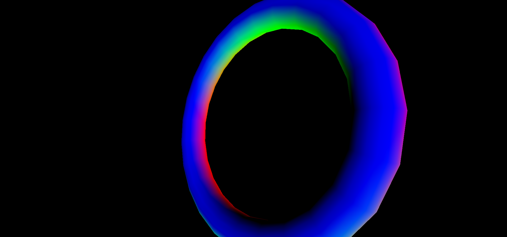
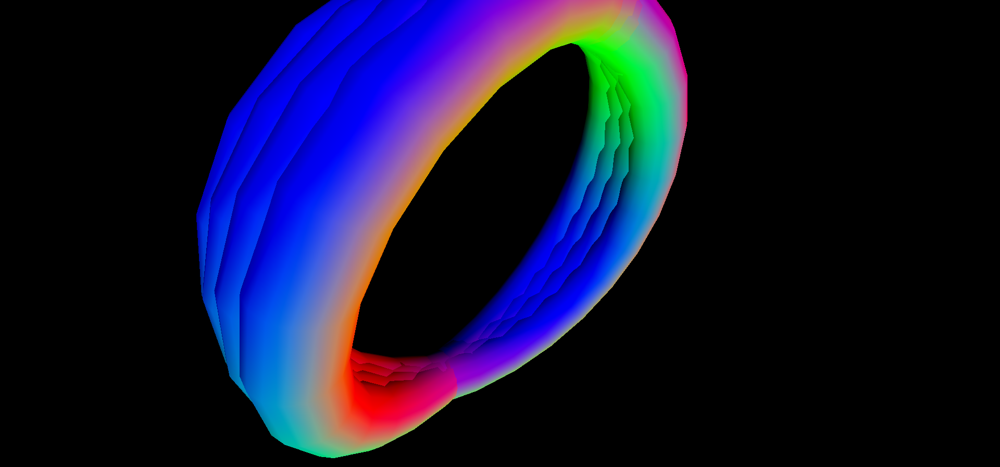
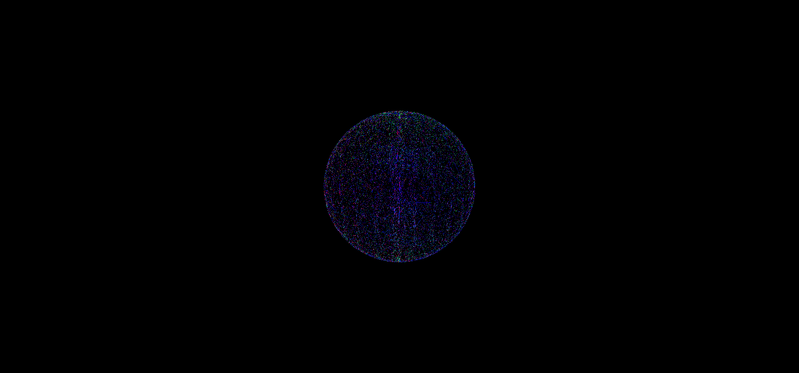

# TORUS EXPERIMENT.

### This is an experiment made with p5.js working over the variables of [Torus.][link]

[link]: https://en.wikipedia.org/wiki/Torus

Play [here.](https://saulofilho.github.io/TORUS/)

Some screenshots:

